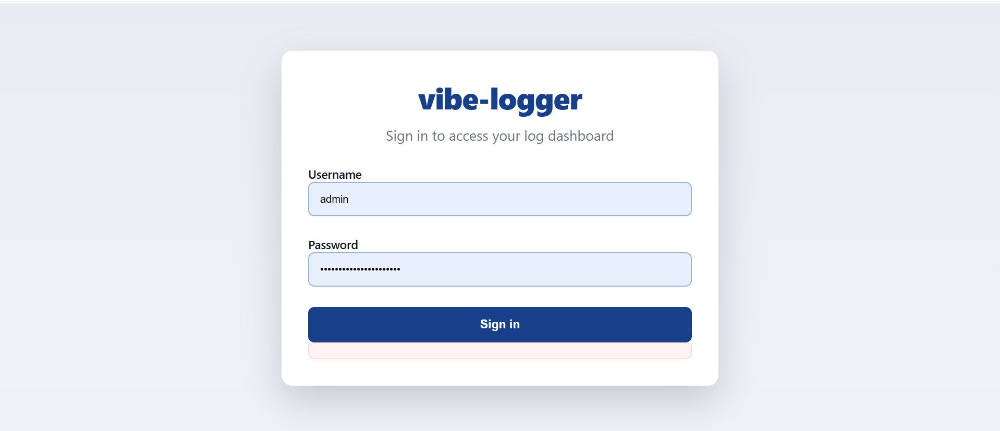
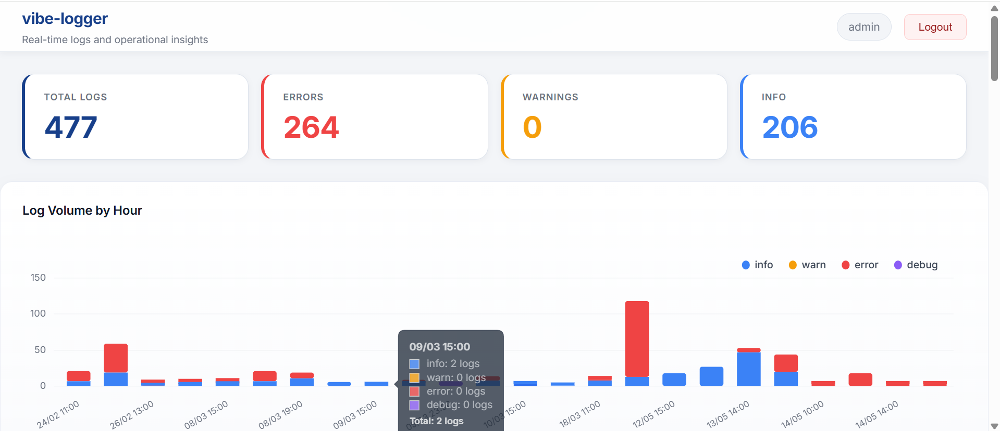
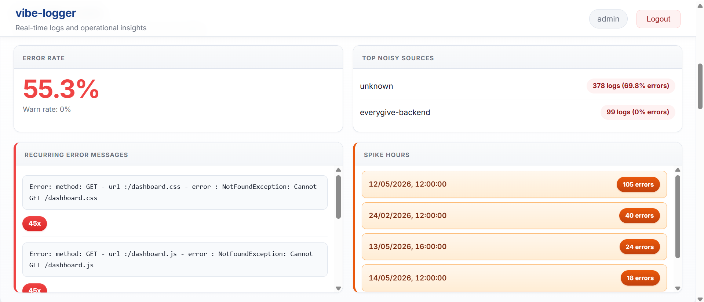
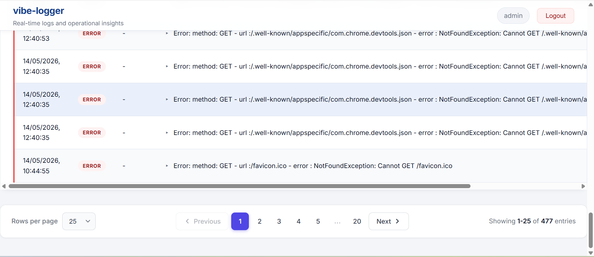

# vibe-logger

[](https://github.com/vcian/vibe-logger/actions/workflows/ci.yml)
[](https://www.npmjs.com/package/@vcian/vibe-logger)
[](https://github.com/vcian/vibe-logger)
[](https://github.com/vcian/vibe-logger/blob/main/LICENSE)
[](https://www.npmjs.com/package/@vcian/vibe-logger)
[](https://www.npmjs.com/package/@vcian/vibe-logger)

**A drop-in log viewer UI & dashboard for Node.js (Express and NestJS)** — search, filter, date-range queries, a time-series volume chart, CSV export, JWT auth, and pluggable memory/file storage for your Winston/Pino-style JSON logs. Self-hosted, zero infrastructure.

### Screenshots

**Secure sign-in** — JWT auth with brute-force lockout.



**Dashboard** — metric cards plus a clickable, time-series log-volume chart by level.



**Quality insights** — error/warn rates, top noisy sources, recurring errors, and spike hours.



**Searchable log table** — paginated, with expandable rows for multi-line messages and metadata.



**Why vibe-logger?**

- **Zero infra** — one Express middleware; no separate log server, database, or agent to run.
- **Reads what you already write** — point it at your existing Winston/Pino JSON log files, or capture logs in-process.
- **Insight, not just tailing** — time-series chart, error/warn rates, noisy-source and spike detection, plus search, filters, and CSV export.

Built by the engineering team at [ViitorCloud Technologies](https://viitorcloud.com/?utm_source=github&utm_medium=readme&utm_campaign=vibe-logger), who use it in production on client projects.

**Repository:** [github.com/vcian/vibe-logger](https://github.com/vcian/vibe-logger)

## Quick start

```bash
npm install @vcian/vibe-logger
```

```ts
import 'dotenv/config';
import express from 'express';
import { createLoggerUI } from '@vcian/vibe-logger';

const app = express();
const logger = createLoggerUI({ path: '/logs', storageMode: 'memory', interceptConsole: true });

app.use(logger.middleware());
app.listen(3000, () => logger.info('Listening on http://localhost:3000/logs'));
```

Then open `http://localhost:3000/logs` and sign in. Full setup — auth, NestJS, and file mode — is documented below.

## How is this different from Errsole, log.io, or frontail?

> **⚠️ Maintainers:** verify every cell in this table against the current behaviour of each tool **before** publishing. A wrong claim in a comparison table is the fastest route to a hostile comment thread.

| | vibe-logger | Errsole | log.io / frontail |
|---|---|---|---|
| Setup | One middleware, zero infra | Logger + storage backend | Separate server process |
| Reads existing Winston/Pino files | ✅ | Own logger required | Tails raw text |
| Charts & insights | ✅ time-series, error rates, spike detection | ✅ | ❌ |
| Auth built in | ✅ JWT + lockout | ✅ | ❌ |
| Works inside NestJS | ✅ | Partial | ❌ |

---

## Table of Contents

1. [Overview](#1-overview)
2. [Installation](#2-installation)
3. [Quick Start — Express](#3-quick-start--express)
4. [Quick Start — NestJS](#4-quick-start--nestjs)
5. [Storage Modes](#5-storage-modes)
  - [5.1 Memory mode](#51-memory-mode)
  - [5.2 File mode — single file](#52-file-mode--single-file)
  - [5.3 File mode — daily rotate (glob)](#53-file-mode--daily-rotate-glob)
  - [5.4 Custom store](#54-custom-store)
6. [Configuration Reference](#6-configuration-reference)
7. [Environment Variables](#7-environment-variables)
8. [Authentication](#8-authentication)
9. [Public API](#9-public-api)
10. [REST Endpoints](#10-rest-endpoints)
11. [Dashboard Walkthrough](#11-dashboard-walkthrough)
12. [Writing Logs (Best Practices)](#12-writing-logs-best-practices)
13. [CSV Export](#13-csv-export)
14. [Security](#14-security)
15. [Troubleshooting](#15-troubleshooting)
16. [Contributing / Changelog / License](#16-contributing--changelog--license)

---

## 1. Overview

`vibe-logger` mounts a small Express router that serves a self-contained log dashboard plus a JSON API. It works in two distinct modes:


| Mode       | Source of logs                                                                 | Use when                                                     |
| ---------- | ------------------------------------------------------------------------------ | ------------------------------------------------------------ |
| **Memory** | Logs you write via `logger.info/warn/error/debug` (and optionally `console.`*) | You want a live, in-process viewer with zero infrastructure. |
| **File**   | A Winston-style JSON log file (or many files via glob)                         | You already write JSON logs to disk and want to browse them. |


### Features

- Time-series volume chart by level (Chart.js), clickable to drill into an hour.
- Search, level filter, source filter, date range (presets + custom), removable filter chips.
- Expandable rows for multi-line messages and structured metadata.
- Quality insights: error/warn rate, top noisy sources, recurring errors, spike hours.
- CSV export of the currently filtered set.
- `.env`-driven auth (bcrypt + JWT cookie), brute-force lockout, multi-user roles.
- Responsive UI for desktop / laptop / tablet.
- TypeScript types shipped, zero hard framework dependency beyond Express.

---

## 2. Installation

```bash
npm install @vcian/vibe-logger
```

Requirements:

- Node.js `>=16`
- `express >=4.18` (peer dependency)
- For NestJS users: the Express platform adapter (default in `@nestjs/platform-express`).

---

## 3. Quick Start — Express

```ts
import 'dotenv/config';
import express from 'express';
import { createLoggerUI } from '@vcian/vibe-logger';

const app = express();

const logger = createLoggerUI({
  path: '/logs',
  source: 'app',
  storageMode: 'memory',
  interceptConsole: true,
});

app.use(logger.middleware());

logger.info('Server started', { port: 3000 });
app.listen(3000, () => logger.info('Listening on http://localhost:3000/logs'));
```

Open `http://localhost:3000/logs` and sign in with the credentials configured in your `.env` file (see [§8](#8-authentication)).

---

## 4. Quick Start — NestJS

`vibe-logger` is just an Express router, so it works inside any NestJS app that uses the default Express adapter (`@nestjs/platform-express`).

### 4.1 Bootstrap-time mount (simplest)

Mount the middleware directly on the underlying Express instance in `main.ts`:

```ts
import 'dotenv/config';
import { NestFactory } from '@nestjs/core';
import { NestExpressApplication } from '@nestjs/platform-express';
import { createLoggerUI } from '@vcian/vibe-logger';
import { AppModule } from './app.module';

async function bootstrap() {
  const app = await NestFactory.create<NestExpressApplication>(AppModule);

  const logger = createLoggerUI({
    path: '/logs',
    source: 'nest-app',
    storageMode: 'file',
    filePath: 'logs/app.log',
  });

  app.use(logger.middleware());
  (global as any).logger = logger;

  await app.listen(3000);
}
bootstrap();
```

### 4.2 As an injectable Nest provider (recommended)

Wrap the logger so any service can inject and use it.

```ts
// logger.module.ts
import { Module, Global } from '@nestjs/common';
import { createLoggerUI, LoggerUI } from '@vcian/vibe-logger';

export const LOGGER = Symbol('LOGGER');

@Global()
@Module({
  providers: [
    {
      provide: LOGGER,
      useFactory: (): LoggerUI =>
        createLoggerUI({
          path: '/logs',
          source: 'nest',
          storageMode: (process.env.LOG_STORAGE_MODE as 'memory' | 'file') ?? 'memory',
        }),
    },
  ],
  exports: [LOGGER],
})
export class LoggerModule {}
```

```ts
// main.ts
import { NestFactory } from '@nestjs/core';
import { NestExpressApplication } from '@nestjs/platform-express';
import { AppModule } from './app.module';
import { LOGGER } from './logger.module';
import type { LoggerUI } from '@vcian/vibe-logger';

async function bootstrap() {
  const app = await NestFactory.create<NestExpressApplication>(AppModule);
  const logger = app.get<LoggerUI>(LOGGER);
  app.use(logger.middleware());
  await app.listen(3000);
}
bootstrap();
```

```ts
// any.service.ts
import { Inject, Injectable } from '@nestjs/common';
import type { LoggerUI } from '@vcian/vibe-logger';
import { LOGGER } from './logger.module';

@Injectable()
export class PaymentsService {
  constructor(@Inject(LOGGER) private readonly logger: LoggerUI) {}

  charge(orderId: string) {
    this.logger.info('Charge started', { orderId });
  }
}
```

### 4.3 Global Nest exception filter

Forward all unhandled exceptions into the viewer:

```ts
import { ArgumentsHost, Catch, ExceptionFilter, HttpException } from '@nestjs/common';
import type { LoggerUI } from '@vcian/vibe-logger';

@Catch()
export class VibeLoggerFilter implements ExceptionFilter {
  constructor(private readonly logger: LoggerUI) {}

  catch(exception: any, host: ArgumentsHost) {
    const ctx = host.switchToHttp();
    const req = ctx.getRequest();
    const status = exception instanceof HttpException ? exception.getStatus() : 500;

    this.logger.error(
      `${exception?.name ?? 'Error'}: ${exception?.message ?? 'Unknown'}\n${exception?.stack ?? ''}`,
      { method: req.method, url: req.url, statusCode: status },
    );

    throw exception;
  }
}
```

> **Fastify users:** This package targets the Express adapter. To use it under `@nestjs/platform-fastify`, either expose an Express bridge for the `/logs` route or migrate that route to Express middleware.

---

## 5. Storage Modes

You pick the mode once at bootstrap. The dashboard, API, filters, chart, and CSV export are identical across modes — only the data source changes.

### 5.1 Memory mode

In-process ring buffer capped by `maxEntries`. The oldest entries are evicted when the cap is reached.

```ts
const logger = createLoggerUI({
  storageMode: 'memory',
  maxEntries: 10_000,
  interceptConsole: true,
});
```


| Characteristic | Behaviour                                                                        |
| -------------- | -------------------------------------------------------------------------------- |
| Persistence    | None — logs are lost on process restart.                                         |
| Ingestion      | `logger.info/warn/error/debug(...)` and (optionally) `console.*` interception.   |
| Cap            | `maxEntries` (default `10000` or `LOG_MAX_ENTRIES`).                             |
| Multi-process  | Each process has its own buffer. Use file mode (or a shared store) for clusters. |
| Best for       | Local dev, single-process apps, demos, integration tests.                        |


Memory mode is the default and requires no config beyond auth.

### 5.2 File mode — single file

Reads a Winston-style JSON log file (one JSON object per line). The viewer parses the file on demand and re-parses it when the file is modified (if live tail is on).

```ts
const logger = createLoggerUI({
  storageMode: 'file',
  filePath: 'logs/app.log',
  fileLiveTail: true,
  maxEntries: 50_000,
});
```

**Expected line format**

```json
{"timestamp":"2026-05-12T07:00:00.000Z","level":"info","message":"Request complete","source":"api","meta":{"status":200,"durationMs":42}}
```

Rules:

- Supported keys: `timestamp`, `level`, `message`, `source`, `meta`.
- Any extra keys are folded into `meta`.
- Malformed lines are skipped (the rest still load).
- Accepted timestamps: ISO strings, Winston `YYYY-MM-DD HH:mm:ss`, epoch seconds or milliseconds (number or string).
- If a timestamp can't be parsed, the entry is still ingested with “now” and tagged `meta._timestampParseFailed=true`.

**Live tail**

With `fileLiveTail: true` (default), the file is re-read whenever its mtime changes — no socket, no polling daemon. Set to `false` if you want a static snapshot.

### 5.3 File mode — daily rotate (glob)

For setups where each day is a separate file (`logs/2026-05-11.log`, `logs/2026-05-12.log`, …):

```ts
const logger = createLoggerUI({ storageMode: 'file' });
```

```env
LOG_STORAGE_MODE=file
LOG_FILE_GLOB=logs/*.log
LOG_FILE_DAYS=30
LOG_FILE_LIVE_TAIL=true
```

Rules:

- Filenames must contain a `YYYY-MM-DD` date — that's how the day window is computed.
- Only files within the last `LOG_FILE_DAYS` days are loaded.
- `LOG_FILE_GLOB` takes precedence over `LOG_FILE_PATH` (unless you pass `filePath` explicitly to `createLoggerUI`).
- The combined entry count is capped by `LOG_MAX_ENTRIES` (newest kept).

### 5.4 Custom store

Inject your own implementation of the `LogStore` interface (e.g. Redis, SQLite, S3-backed):

```ts
import { createLoggerUI, LogStore } from '@vcian/vibe-logger';

const myStore: LogStore = {
  append(entry) { /* ... */ return { ...entry, id: 'uuid' } as any; },
  query(opts)   { /* ... */ return { data: [], total: 0 }; },
  stats()       { /* ... */ return /* StatsResult */ as any; },
  clear()       { /* ... */ },
  getSources()  { return []; },
};

const logger = createLoggerUI({ store: myStore });
```

When `store` is provided, `storageMode` / `filePath` / `maxEntries` are ignored.

---

## 6. Configuration Reference

All options accepted by `createLoggerUI(options)`:


| Option             | Type       | Default                             | Description                                                 |
| ------------------ | ---------- | ----------------------------------- | ----------------------------------------------------------- |
| `path`             | `string`   | `"/logs"` (or `LOG_VIEWER_PATH`)    | Mount path for the UI and API.                              |
| `source`           | `string`   | `"app"`                             | Default `source` label for `logger.info/warn/error/debug`.  |
| `interceptConsole` | `boolean`  | `false`                             | Capture `console.log/info/warn/error/debug` into the store. |
| `storageMode`      | `"memory"  | "file"`                             | `"memory"` (or `LOG_STORAGE_MODE`)                          |
| `maxEntries`       | `number`   | `10000` (or `LOG_MAX_ENTRIES`)      | Cap for memory/file stores (oldest entries evicted).        |
| `filePath`         | `string`   | `logs/app.log` (or `LOG_FILE_PATH`) | Single-file path when `storageMode: 'file'`.                |
| `fileLiveTail`     | `boolean`  | `true` (or `LOG_FILE_LIVE_TAIL`)    | Reload file(s) when modified.                               |
| `store`            | `LogStore` | `undefined`                         | Inject a custom store (overrides all storage options).      |


Resolution order for each setting: **explicit option → env var → built-in default**.

---

## 7. Environment Variables

All vars are read from `process.env` (load via `dotenv` or your platform).

### Authentication


| Key                 | Default                 | Description                                                                             |
| ------------------- | ----------------------- | --------------------------------------------------------------------------------------- |
| `LOG_AUTH_ENABLED`  | `true`                  | Master switch. When `true`, all UI and API routes require login.                        |
| `LOG_USERNAME`      | `admin`                 | Single-user username.                                                                   |
| `LOG_PASSWORD_HASH` | *required when auth on* | Bcrypt hash of the password (use the CLI below).                                        |
| `LOG_JWT_SECRET`    | *required, ≥32 chars*   | Signing secret for the session JWT.                                                     |
| `LOG_SESSION_TTL`   | `3600`                  | Session length in seconds.                                                              |
| `LOG_MAX_ATTEMPTS`  | `5`                     | Failed logins allowed before lockout.                                                   |
| `LOG_LOCKOUT_MINS`  | `15`                    | Lockout duration after `LOG_MAX_ATTEMPTS`.                                              |
| `LOG_USERS`         | empty                   | Optional JSON array for multi-user mode (overrides `LOG_USERNAME`/`LOG_PASSWORD_HASH`). |


### Viewer & storage


| Key                  | Default        | Description                                         |
| -------------------- | -------------- | --------------------------------------------------- |
| `LOG_VIEWER_PATH`    | `/logs`        | Default mount path (overridable via `path` option). |
| `LOG_MAX_ENTRIES`    | `10000`        | Entry cap for memory/file stores.                   |
| `LOG_STORAGE_MODE`   | `memory`       | `memory` or `file`.                                 |
| `LOG_FILE_PATH`      | `logs/app.log` | Single JSON log file.                               |
| `LOG_FILE_GLOB`      | empty          | Glob for daily-rotate mode (e.g. `logs/*.log`).     |
| `LOG_FILE_DAYS`      | `30`           | Days included when using `LOG_FILE_GLOB`.           |
| `LOG_FILE_LIVE_TAIL` | `true`         | Reload file(s) when their mtime changes.            |


### Minimal `.env` example

```env
LOG_AUTH_ENABLED=true
LOG_USERNAME=admin
LOG_PASSWORD_HASH=$2a$10$replace_with_real_hash
LOG_JWT_SECRET=a-long-random-string-of-32-chars-or-more
LOG_SESSION_TTL=3600

LOG_STORAGE_MODE=file
LOG_FILE_PATH=logs/app.log
LOG_FILE_LIVE_TAIL=true
LOG_MAX_ENTRIES=50000
```

> Startup fails fast if `LOG_AUTH_ENABLED=true` and any of `LOG_JWT_SECRET` / `LOG_PASSWORD_HASH` are missing, if the secret is the placeholder value, or if it's shorter than 32 characters.

---

## 8. Authentication

### Generating a password hash

```bash
npx @vcian/vibe-logger hash-password "your-password"
```

Copy the output into `LOG_PASSWORD_HASH`.

### Single user

```env
LOG_USERNAME=admin
LOG_PASSWORD_HASH=$2a$10$...
```

### Multiple users / roles

Set `LOG_USERS` to a JSON array (this **overrides** `LOG_USERNAME` / `LOG_PASSWORD_HASH`):

```json
[
  { "username": "admin",  "passwordHash": "$2a$10$...", "role": "admin"  },
  { "username": "viewer", "passwordHash": "$2a$10$...", "role": "viewer" }
]
```

### Session model

- Login `POST <mountPath>/auth/login` (e.g. `POST /logs/auth/login`) issues an `lgr_session` JWT cookie.
- Cookie flags: `httpOnly`, `sameSite: 'strict'`, `secure` in production.
- TTL controlled by `LOG_SESSION_TTL`.
- Logout `POST <mountPath>/auth/logout` clears the cookie.

### Brute-force protection

The login route is rate-limited. After `LOG_MAX_ATTEMPTS` failures, the client is locked out for `LOG_LOCKOUT_MINS` minutes.

### Disabling auth (local dev only)

```env
LOG_AUTH_ENABLED=false
```

Never disable auth on a network-reachable instance.

---

## 9. Public API

```ts
import { createLoggerUI, LoggerUI, LogStore, LogEntry } from '@vcian/vibe-logger';
```

### `createLoggerUI(options?: CreateLoggerUIOptions): LoggerUI`

Returns:

```ts
interface LoggerUI {
  middleware(): Router;                                         // mount with app.use(...)
  info(message: string, meta?: object): void;
  warn(message: string, meta?: object): void;
  error(message: string, meta?: object): void;
  debug(message: string, meta?: object): void;
}
```

### Special `meta` keys


| Key          | Effect                                                                        |
| ------------ | ----------------------------------------------------------------------------- |
| `_timestamp` | ISO string override for the entry's timestamp (useful for replays/backfills). |


### Exported types

`LogEntry`, `LogLevel`, `LogStore`, `QueryOptions`, `QueryResult`, `StatsResult`, `StorageMode`, `CreateLogStoreOptions`, `HourBucket`, `SourceInsight`, `ErrorMessageInsight`, `SpikeHourInsight`.

---

## 10. REST Endpoints

All paths below are **relative to the mount path** (default `/logs`). With the default mount path, prepend `/logs` to get the full URL — e.g. `GET /logs/logs`, `POST /logs/auth/login`.

All routes (except `/login` and the static assets) require auth when `LOG_AUTH_ENABLED=true`.


| Method | Path               | Description                                                                                                                                                                                                    |
| ------ | ------------------ | -------------------------------------------------------------------------------------------------------------------------------------------------------------------------------------------------------------- |
| `GET`  | `/`                | HTML dashboard.                                                                                                                                                                                                |
| `GET`  | `/login`           | Login HTML page.                                                                                                                                                                                               |
| `GET`  | `/dashboard.css`   | Dashboard stylesheet (static asset).                                                                                                                                                                           |
| `GET`  | `/dashboard.js`    | Dashboard script (static asset).                                                                                                                                                                               |
| `POST` | `/auth/login`      | `{ username, password }` → sets `lgr_session` JWT cookie.                                                                                                                                                      |
| `POST` | `/auth/logout`     | Clears the `lgr_session` cookie.                                                                                                                                                                               |
| `GET`  | `/logs`            | Paginated log list. Query params: `level`, `source`, `search`, `startDate`, `endDate`, `limit`, `offset`.                                                                                                      |
| `GET`  | `/logs/stats`      | Aggregates for the active filter set: totals by level, hour buckets, error/warn rate, top noisy sources, recurring errors, spike hours. Also returns the `sources` array used to populate the filter dropdown. |
| `GET`  | `/logs/export/csv` | CSV download of the filtered set (same query params as `GET /logs`).                                                                                                                                           |


> **No separate sources endpoint.** Source labels are returned in the `sources` field of the `GET /logs/stats` response — there is no standalone `/sources` route.

---

## 11. Dashboard Walkthrough

Open the mount path in a browser. The page is laid out top-down for fast triage.

1. **Metric cards** — Total / Errors / Warnings / Info for the active filter set.
2. **Log Volume by Hour** — stacked bar chart by level. Click a bar to filter to that hour; click again to clear.
3. **Quality Insights**
  - **Error Rate / Warn Rate** — health signal scoped to current filters.
  - **Top Noisy Sources** — highest-volume sources with their own error rate.
  - **Recurring Error Messages** — most repeated error texts.
  - **Spike Hours** — hours with unusually high activity or error concentration.
4. **Filter toolbar** — search (debounced, matches message + source), level dropdown, source dropdown, date range (presets `1h` / `24h` / `7d` / `Custom` with `Apply` / `Cancel` / `Clear` and inline validation), `Clear Filters`, `Export CSV`. Active filters appear as removable chips.
5. **Log table** — Timestamp, Level (coloured badge), Source, Message. Only the **first line** of the message is shown; a `▸` caret marks rows with more content. Click a row to expand:
  - **Full message** — complete multi-line content, monospaced and scrollable.
  - **Metadata** — pretty-printed JSON of the `meta` payload.

The UI is responsive (desktop / laptop / tablet) and re-flows toolbar, insights, and pagination at smaller widths.

---

## 12. Writing Logs (Best Practices)

The viewer renders only the **first line** of the message in the table and tucks the rest into the expandable detail panel. Structure your logs around that.

### Shape

Keep the first line short and scannable. Put context in `meta`.

```ts
logger.info('Request complete', { method: 'GET', path: '/users', status: 200, durationMs: 42 });
logger.warn('Slow query detected', { sqlHash: 'ab12', durationMs: 1800, rows: 3200 });
logger.error('Failed to charge customer', { customerId: 'cus_123', provider: 'stripe', code: 'card_declined' });
```

### Errors with stack traces

```ts
try {
  await userService.load(id);
} catch (error) {
  logger.error(
    `${error.name}: ${error.message}\n${error.stack}`,
    { requestId: req.id, userId: id },
  );
}
```

### Express error middleware

```ts
app.use((err, req, _res, next) => {
  logger.error(
    `${err.name ?? 'Error'}: ${err.message}\n${err.stack ?? ''}`,
    { method: req.method, url: req.originalUrl, ip: req.ip, statusCode: err.status ?? 500 },
  );
  next(err);
});
```

### Choosing a level


| Level   | Use for                                                          |
| ------- | ---------------------------------------------------------------- |
| `info`  | Normal lifecycle events, successful requests, state transitions. |
| `warn`  | Recoverable issues, slow operations, deprecation hits.           |
| `error` | Thrown exceptions, failed jobs, 5xx responses.                   |
| `debug` | Verbose diagnostics for non-production.                          |


### Capturing legacy `console.*`

Set `interceptConsole: true`. Any `console.log/info/warn/error/debug` from third-party or legacy code will appear in the viewer with no refactor.

### Replaying historical events

Pass `meta._timestamp` (ISO string) to override the ingestion time. Useful when importing past data.

---

## 13. CSV Export

- Endpoint: `GET /logs/export/csv` (relative to the mount path; with default mount `/logs` the full URL is `/logs/logs/export/csv`).
- Columns: `id, timestamp, level, source, message, meta`.
- `meta` is JSON-encoded.
- Filename: `logs-YYYY-MM-DD.csv`.
- Respects the same query parameters as `GET /logs` (so the toolbar's filters carry over to the download).

---

## 14. Security

- Auth routes are rate-limited.
- JWT cookies are `httpOnly`, `sameSite: 'strict'`, and `secure` in production.
- Startup validation refuses to boot with a missing/short/placeholder `LOG_JWT_SECRET` when auth is enabled.
- The package never logs the password or JWT.
- File mode reads only the paths you configure — globs are resolved relative to the process CWD, not user input.
- Responsible disclosure: see [SECURITY.md](./SECURITY.md).

---

## 15. Troubleshooting


| Symptom                                               | Likely cause / fix                                                                                                               |
| ----------------------------------------------------- | -------------------------------------------------------------------------------------------------------------------------------- |
| `Missing required environment variables` at startup   | Set `LOG_JWT_SECRET` and `LOG_PASSWORD_HASH`, or set `LOG_AUTH_ENABLED=false` for local dev.                                     |
| `LOG_JWT_SECRET must be at least 32 characters long.` | Generate a longer random secret.                                                                                                 |
| Logout button visible when `LOG_AUTH_ENABLED=false`   | Upgrade to the latest version — older builds showed auth UI unconditionally; it is now hidden when auth is disabled.             |
| Logging in succeeds but the page redirects to login   | Cookie blocked. In production, ensure HTTPS so the `secure` cookie flag works; behind a proxy, set `app.set('trust proxy', 1)`.  |
| Memory mode shows no logs after restart               | Expected — memory mode is non-persistent. Switch to file mode.                                                                   |
| File mode shows no logs                               | Confirm the file exists, is readable, and contains one JSON object per line. Check `meta._timestampParseFailed` on rows.         |
| Daily glob shows no logs                              | Ensure filenames contain `YYYY-MM-DD` and fall within `LOG_FILE_DAYS`.                                                           |
| 401 on every request after deploy                     | Clock skew can invalidate JWTs — sync server time (NTP).                                                                         |
| NestJS + Fastify: UI doesn't load                     | Use `@nestjs/platform-express` or bridge the route via Express.                                                                  |
| `npm audit` reports vulnerabilities after install     | Run `npm install` with the latest published version — the package pins safe dependency ranges via `overrides` in `package.json`. |


---

## 16. Contributing / Changelog / License

- **Source & issues:** [github.com/vcian/vibe-logger](https://github.com/vcian/vibe-logger)
- **Contributing:** [CONTRIBUTING.md](./CONTRIBUTING.md)
- **Code of Conduct:** [CODE_OF_CONDUCT.md](./CODE_OF_CONDUCT.md)
- **Changelog:** [CHANGELOG.md](./CHANGELOG.md)
- **Security policy:** [SECURITY.md](./SECURITY.md)
- **License:** MIT — see [LICENSE](./LICENSE).

---

## About ViitorCloud

**[ViitorCloud Technologies](https://viitorcloud.com/?utm_source=github&utm_medium=readme&utm_campaign=vibe-logger)** is an AI-first technology services company building AI/ML, data, and modern web solutions for clients across North America, Europe, and APAC. Our engineering team builds and maintains this package — and uses it in production on client projects.

- 🌐 [viitorcloud.com](https://viitorcloud.com/?utm_source=github&utm_medium=readme&utm_campaign=vibe-logger)
- 🧰 [More open source from ViitorCloud](https://github.com/vcian)
- 💬 Questions or commercial support: support@viitorcloud.com
- 💼 [Work with our team](https://viitorcloud.com/contact-us?utm_source=github&utm_medium=readme&utm_campaign=vibe-logger)

If this package saves you time, **⭐ star the repo** — it's the main way other developers discover it.

